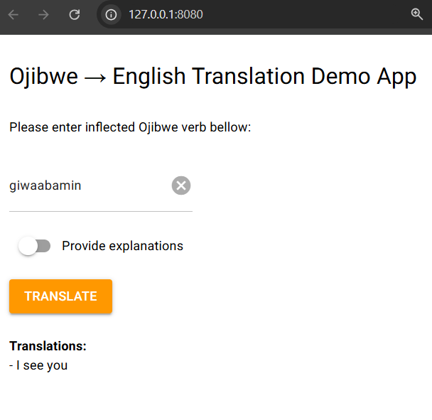
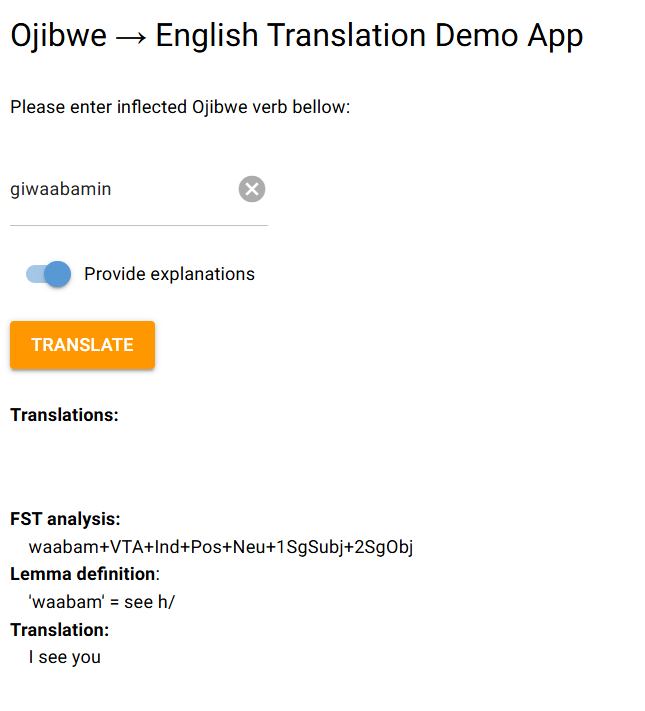

## Ojibwe -> English Web App

This is the web interface for the Ojibwe Translation package. 
It is built on NiceGUI framework.

### Installation

Please install the required dependencies using the command:
- First, please install the `ojibwe_translation` package as in the previous [README](../README.md) file 
- Change to the app directory 
    
    `cd app` 
- Install the dependencies (`nicegui` and `ojibwe_translation` packages) 

    `pip install -r requirements.txt`

### Run the app
- Run the app: `python main.py`
- Open web browser and go to `localhost:8080` 
- Enter an Ojibwe word into the textbox and click `Translate`button
- (Optional) turn on the `Provide explanations` switch, and click the `Translate` button to get more detailed steps / explanations of the translations. 

### Screenshots

